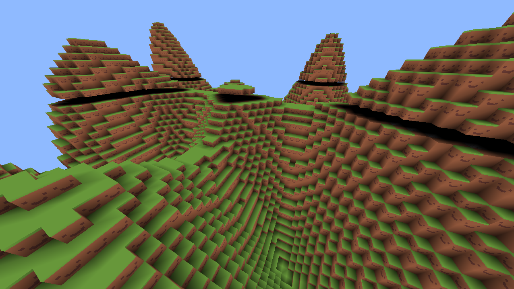

# willcraft

This is a block construction game. Not at all similar to any other game you
know.

# screenshots

I use simple ambient occlusion lighting in order to determine how bright each
vertex should be. I also use occlusion and backface culling as well as VBOs to
minimize draw calls to support millions of blocks.

# goals

Currently working on raytracing and collisions.
